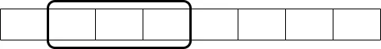

## 문제

N개의 수 $A_1, A_2, ..., A_N$과 $L$이 주어진다.

$D_i$ = $A_{i-L+1}$ ~ $A_i$ 중의 최솟값이라고 할 때, D에 저장된 수를 출력하는 프로그램을 작성하시오. 이때, i ≤ 0 인 Ai는 무시하고
D를 구해야 한다.

## 입력

첫째 줄에 N과 L이 주어진다. (1 ≤ L ≤ N ≤ 5,000,000)

둘째 줄에는 N개의 수 $A_i$가 주어진다. (-109 ≤ Ai ≤ 109)

## 출력

첫째 줄에 $D_i$를 공백으로 구분하여 순서대로 출력한다.

## 풀이

이 문제는 덱과 슬라이딩 윈도우 개념을 이용하면 쉽게 풀리는 문제입니다.

덱은 간단히 말해 앞과 뒤로 모두 나올 수 있는 큐라고 생각하시면 됩니다.

슬라이딩 윈도우는 아래 그림처럼 고정된 길이를 탐색해 나가며 목표를 달성하는 기법입니다.





이 문제에서는 이 덱에 앞쪽에 최솟값을 저장하고 뒤쪽에는 최솟값 후보를 저장합니다.

또한 값을 저장할때 원본 배열의 인덱스도 같이 저장해 순서 데이터도 보존해줍니다.

그렇게 생각했을 때 플로우를 보면 다음과 같습니다.

1. 덱이 비어있으면 새 값과 인덱스를 넣음.
2. 새 값보다 덱의 뒤 값이 크거나 같으면 뒤에서부터 모두 제거.
3. 덱의 앞 값이 윈도우 범위를 벗어나면 앞에서 제거.
4. 덱에 새 값과 인덱스를 삽입.
5. 덱의 앞 값이 현재 구간의 최소값이므로 출력.

백준 예시 입력 앞부분을 그림으로 보면 다음과 같습니다.


## 코드

```cpp
#include <deque>
#include <iostream>

using namespace std;

int N, L;
int arr[5000000];
deque<pair<int, int>> dq;

int main()
{
    ios_base::sync_with_stdio(false);
    cin.tie(nullptr);
    cin.tie(nullptr);

    cin >> N >> L;

    for (int i = 0; i < N; ++i) cin >> arr[i];

    for (int i = 0; i < N; ++i)
    {
        if (!dq.empty())
        {
            if (dq.front().second < i - L + 1) dq.pop_front();
        }
        while (!dq.empty() && dq.back().first > arr[i]) dq.pop_back();
        dq.push_back(make_pair(arr[i], i));
        cout << dq.front().first << " ";
    }
}
```
