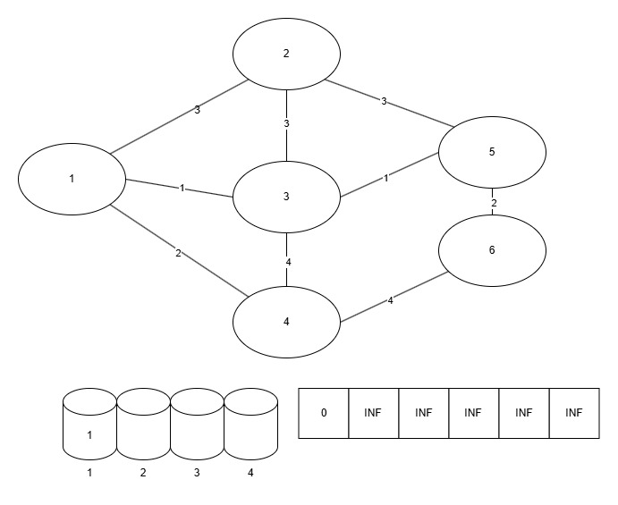
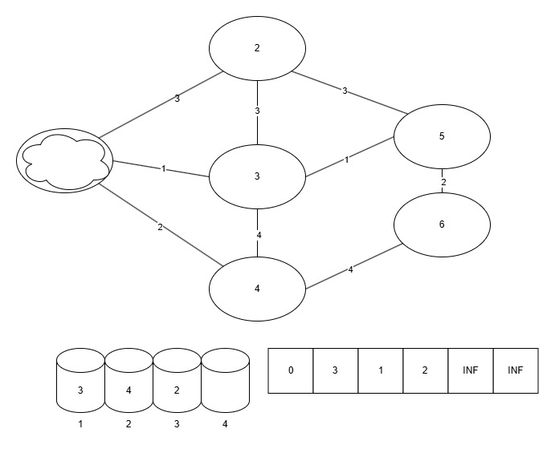
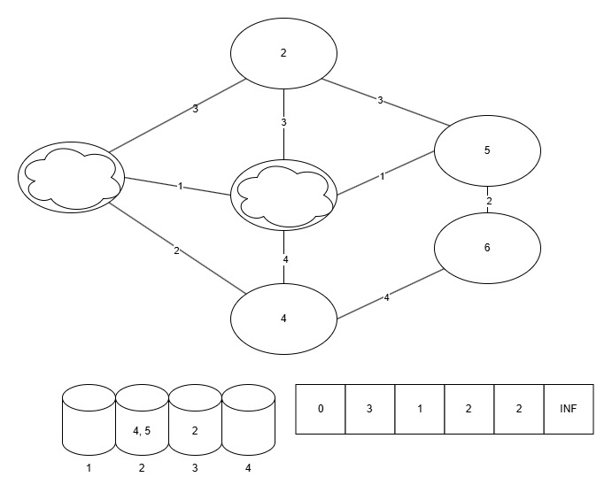
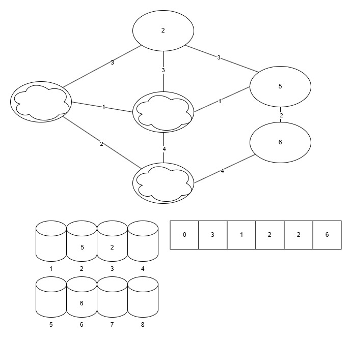
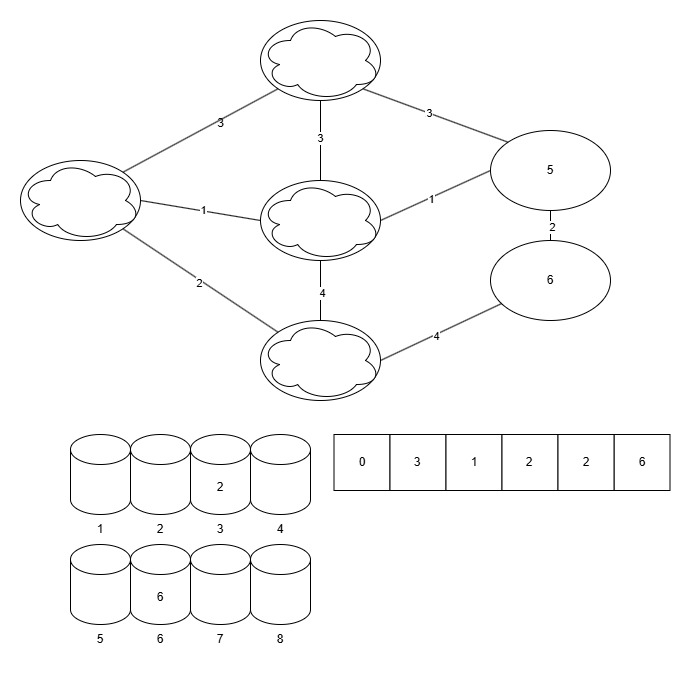
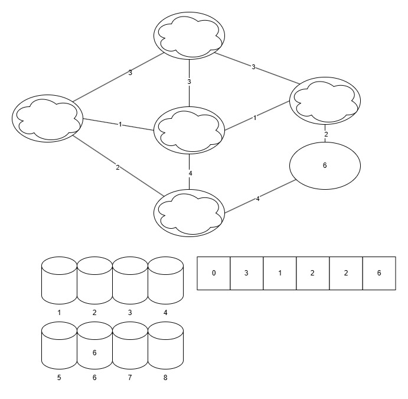
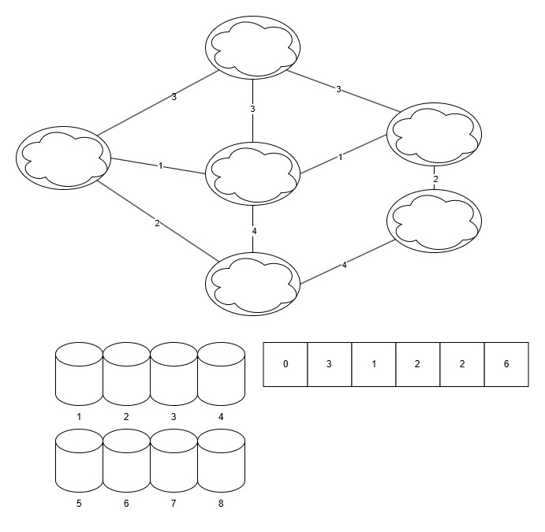

## 개요

다익스트라 알고리즘은 간선의 개수가 $E$이고 정점의 개수가 $V$일 때 시간복잡도가 $O(E\log V)$입니다.

하지만 가중치의 최댓값이 더 작을 때 이걸 더 최적화할 수 있는 방법이 있습니다.

그것이 바로 다이얼 알고리즘입니다.

이 알고리즘은 다익스트라 알고리즘과 비슷한 조건, 음수가 아닌 **정수** 가중치 간선일 때 동작하고 특히 간선의 가중치가 작을 때 매우 효율적으로 동작합니다.

어떻게 이게 가능하냐면 일반적인 다익스트라 알고리즘은 우선순위 큐를 사용하지만 이 알고리즘은 배열 형태의 자료구조를 이용하여 우선순위 큐를 대체하기 때문입니다.

## 작동 원리

1. 버킷(B)이라고 부르는 배열 형태의 자료구조를 가중치의 최댓값의 크기의 길이 x 간선의 개수로 준비합니다. (이 때 각 인덱스는 거리를 의미합니다. ***중요!!***)
2. 거리 배열(dist)을 준비하고 시작 정점의 거리는 0, 나머지 정점의 거리는 무한대로 초기화합니다.
3. 시작 정점을 버킷에 추가합니다.
4. 다음을 모든 정점이 처리되거나 버킷이 빌 때까지 반복합니다.
   1. 현재 가장 작은 인덱스를 가진, 비어있지 않은 버킷(B[i])을 찾습니다.
   2. 버킷에서 정점 하나(u)를 꺼냅니다.
   3. 정점 u에 연결된 모든 간선 (u, v)에 대해 다음을 수행합니다.
      1. 만약 u를 거쳐 v로 가는 경로가 기존에 알려진 경로보다 짧다면
         1. 거리배열(dist[v])를 업데이트(dist[u]+u에서 v까지의 가중치)합니다.
         2. v를 방문처리합니다.
         3. B[dist[v]]에 v를 추가합니다.

## 그림









## 코드

```cpp
#include <iostream>
#include <limits>
#include <list>
#include <vector>

using namespace std;

vector<int> dist;
vector<list<int>> buckets;
vector<list<pair<int, int>>> adj_list;
int num_vertices = 6;
int max_edge_w = 5;
int source = 0;
int max_weight = 7;

const int INF = numeric_limits<int>::max();

vector<int> dialAlgorithm()
{
    dist[source] = 0;

    int max_path_sum = (num_vertices - 1) * max_weight;

    buckets.resize(max_path_sum + 1);

    for (int i = 0; i < max_path_sum; ++i)
    {
        while (!buckets[i].empty())
        {
            int cur_vertex = buckets[i].front();
            buckets[i].pop_front();

            if (dist[cur_vertex] < i) continue;

            for (const auto& edge : adj_list[cur_vertex])
            {
                int next_vertex = edge.first;
                int edge_weight = edge.second;

                if (dist[cur_vertex] + edge_weight < dist[next_vertex])
                {
                    dist[next_vertex] = dist[cur_vertex] + edge_weight;
                    buckets[dist[next_vertex]].push_back(next_vertex);
                }
            }
        }
    }

    return dist;
}

int main()
{
    adj_list.resize(num_vertices);

    adj_list[0].push_back({1, 2});
    adj_list[0].push_back({2, 5});
    adj_list[1].push_back({0, 2});
    adj_list[1].push_back({2, 1});
    adj_list[1].push_back({3, 7});
    adj_list[2].push_back({0, 5});
    adj_list[2].push_back({1, 1});
    adj_list[2].push_back({3, 3});
    adj_list[2].push_back({4, 2});
    adj_list[3].push_back({1, 7});
    adj_list[3].push_back({2, 3});
    adj_list[3].push_back({4, 1});
    adj_list[3].push_back({5, 4});
    adj_list[4].push_back({2, 2});
    adj_list[4].push_back({3, 1});
    adj_list[4].push_back({5, 6});
    adj_list[5].push_back({3, 4});
    adj_list[5].push_back({4, 6});

    vector<int> shortest_distances = dialAlgorithm();

    return 0;
}
```

## 장점

- W가 작을 때: 힙을 사용하는 다익스트라 알고리즘($O(E log V)$ 또는 $O((E+V)log V)$)보다 빠를 수 있습니다. 특히, 그래프가 조밀(dense)하고 W가 작을 때 효과적입니다.
- 구현: 개념적으로 힙보다 간단하게 느껴질 수 있습니다 (배열과 리스트만 사용).

## 단점

- W가 클 때: V*W 항 때문에 성능이 매우 나빠질 수 있습니다. 이 경우 힙 기반 다익스트라가 훨씬 효율적입니다.
- 음수 가중치: 다익스트라와 마찬가지로 음수 가중치 간선이 있으면 사용할 수 없습니다.

## 참고자료

- [dial's-algorithm GeekforGeeks](https://www.geeksforgeeks.org/dials-algorithm-optimized-dijkstra-for-small-range-weights)
