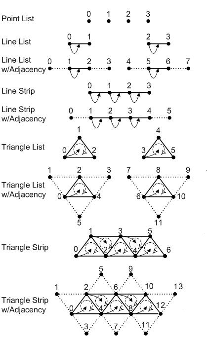

## 개요

DirectX 3D에는 Primitive Type이란 것과 Primitive Adjacency가 있습니다.

Primitive Type은 각 정점(Vertex)들을 파이프라인에서 어떻게 해석하고 렌더링할지 정합니다.

Primitive Adjacency는 둘러싸고 있는 정점들을 데이터에 포함할 지 여부입니다.

각 Primitive Type마다 Primitive Adjacency에 따라 2종류의 타입이 존재합니다.

이 것은 각 Primitive Type의 이름 뒤에 `_ADJ`가 붙는지 여부에 따라 구별됩니다.

## Primitive Types

기본적인 Primitive Types는 Point List, Line List, Line Strip, Triangle List, Triangle Strip이 존재합니다.

각각의 타입들은 다음 그림과 같이 해석됩니다.

여기서 Strip은 다른 데이터끼리 같은 정점을 공유하고 List는 그렇지 않습니다.

그리하여 기하 구조에 따라 다르겠지만 각각의 Strip은
일반적으로는 메모리 접근에 대한 시간을 줄여줍니다.
