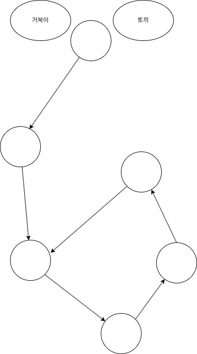
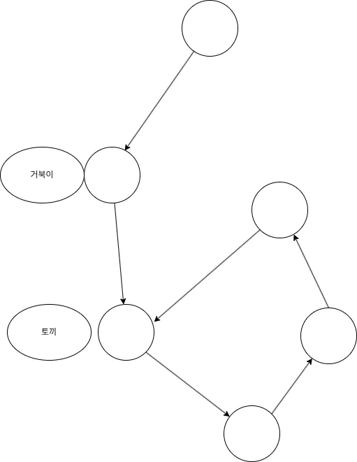
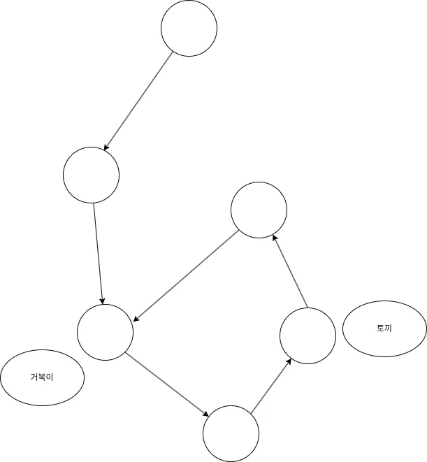
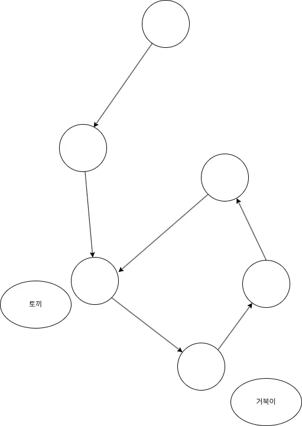
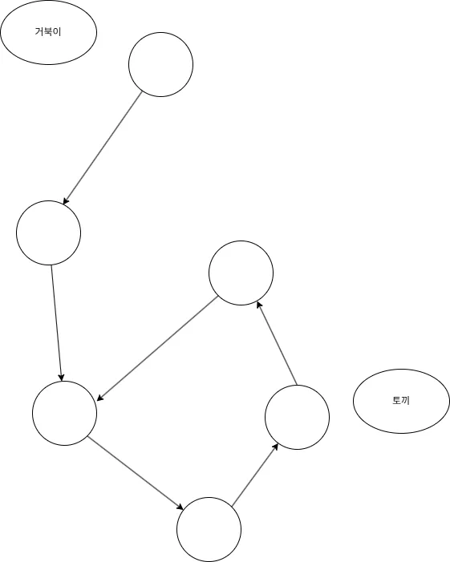
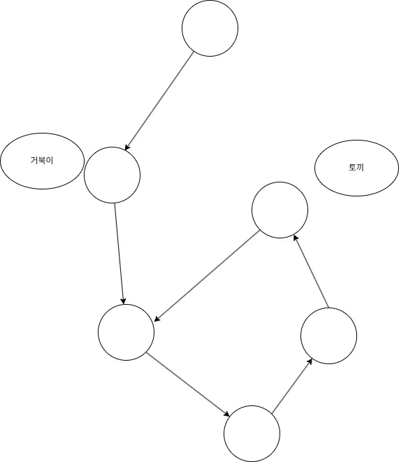
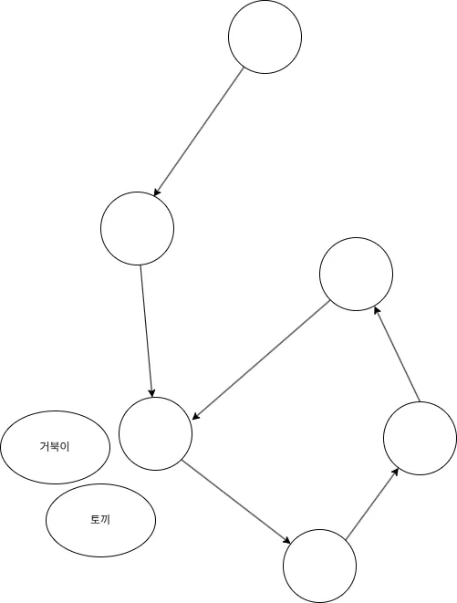

## 개요

토끼와 거북이 알고리즘, Floyd's Tortoise and Hare Algorithm은 연결 리스트에서 사이클의 존재 여부를
찾기 위해 고안된 알고리즘입니다.

이 알고리즘은 1967년 Robert W. Floyd의 논문에 나타났으며, "Tortoise and Hare"라는 이름은 이솝 우화에서 유래했습니다.

또한 이 알고리즘을 활용하면 사이클의 시작점과 길이를 찾을 수 있습니다.

판별하는데 필요한 시간복잡도는 $O(N)$ ($N$: 노드의 수)이며 필요한 공간복잡도는 $O(1)$입니다.

## 동작 원리

먼저 토끼라고 이름을 붙인 포인터와 거북이라고 이름을 붙인 포인터를 시작점에 둡니다.

토끼 포인터는 한 번 움직일 때 2칸씩 이동하고 거북이 포인터는 한 번 움직일 때 1칸씩 이동합니다.

두 포인터를 동시에 이동시키면서 만약 두 포인터가 만나면 사이클이 존재하는 것이고 토끼 포인터가 리스트의 끝에 도달한다면
연결 리스트에 사이클이 없는 것입니다.

사이클의 시작점을 찾으려면 만난 후에 거북이를 시작점으로 다시 옮깁니다.

그 후 이번엔 두 포인터를 한 칸 씩 이동시킵니다.

그러면 두 포인터가 만나는 지점이 사이클의 시작점입니다.

### 동작 원리와 수학적 이해

- 시작점부터 사이클 시작점까지 거리: $\mu$
- 사이클 내 거북이의 첫번째 만남까지 이동거리: $m$
- 사이클 길이: $\lambda$
- 토끼가 사이클을 회전한 횟수: $k$
- 거북이 총 이동거리: $i$
- 토끼 총 이동거리: $2i$

첫 만남까지 거북이가 이동한 거리는 다음과 같습니다.

$$\mu + m$$

토끼가 이동한 거리는 거북이보다 2배 속도가 빠르므로 다음과 같이 됩니다.

$$2i=2(\mu+m)$$

다시 토끼가 이동한 거리를 써보면 토끼는 시작점 -> 사이클 회전 -> m만큼 추가 이동이므로 아래와 같이 됩니다.

$$2i = \mu + k\lambda + m$$

즉 정리하면 다음과 같습니다.

$$2(\mu + m)=\mu+k\lambda+m$$

$$\mu+m=k\lambda$$

그러면 처음 만나는 위치는 사이클의 시작지점에서 $m$만큼 떨어진 지점에서 만납니다.

사이클의 시작지점은 거북이의 경우 $\mu$칸, 토끼의 경우 $k\lambda$칸 이동하면 찾을 수 있습니다.

추가적으로 $m$은 사이클의 시작지점에서 거리이므로 아래의 식이 성립합니다.

$$(k\lambda - \mu) \mod \lambda$$

따라서 사이클 시작점에서 처음 만나는 지점까지의 거리의 식이 유도됩니다.

$$\lambda - (\mu \mod \lambda)$$

## 참고자료

- [Floyd's Algorithm Wikipedia](https://en.wikipedia.org/wiki/Cycle_detection)
