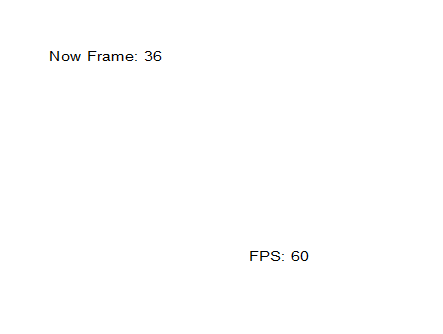

# 목표

이 글에서는 Performance Counter를 이용해서 프로그램의 FPS(Frame Per Second)를 60으로 동기화하는 작업을 할 것입니다.

# 개념

## QueryPerformaceCounter

QueryPerformanceCounter 함수는 Performace Counter의 타임 스탬프를 반환하는 함수로 이를 이용하면 정확한 시간을 알 수 있습니다.

## QueryPerformaceFrequency

이 함수는 Performance Counter의 초당 카운트 횟수를 검색하는 함수로 위 함수와 같이 사용해 카운터를 실제 시간 단위로 변환할 수 있습니다.

# 구현

## 구현 계획

윈도우 API의 PeekMessage 함수를 이용해서 렌더링을 논블로킹으로 하고 QueryPerformanceCounter와 QueryPerformanceFrequency 함수를 Sleep 함수에 사용하여 남는 시간동안 프로그램이 놀도록 할 계획입니다.

### 1차 시도

1차 시도에서의 주요 코드는 다음과 같았습니다.

```cpp
while (running)
{
    // 윈도우 메시지 처리
    while (PeekMessage(&msg, NULL, 0, 0, PM_REMOVE))
    {
        if (msg.message == WM_QUIT) running = false;
        TranslateMessage(&msg);
        DispatchMessage(&msg);
    }

    // 프레임 시간 측정
    QueryPerformanceCounter(&currentTime);
    deltaTime =
        static_cast<double>(currentTime.QuadPart - prevTime.QuadPart) /
        frequency.QuadPart;

    double sleepTime = FRAME_TIME - deltaTime;

    if (sleepTime > 0) Sleep(1000 * sleepTime);
    prevTime = currentTime;

    fpsTime += deltaTime + sleepTime;
    frameCount++;

    // 화면 렌더링 (FPS 표시)
    RenderGraphics(hWnd, frameCount);

    // 1초마다 FPS 출력
    if (fpsTime >= 1.0)
    {
        HDC hdc = GetDC(hWnd);
        TCHAR str[50];
        StringCbPrintf(str, sizeof(str) * sizeof(TCHAR), TEXT("FPS: %d"),
                       frameCount);
        TextOut(hdc, 300, 300, str, lstrlen(str));
        ReleaseDC(hWnd, hdc);
        frameCount = 0;
        fpsTime = 0.0;
    }
}
```

이 코드로 메시지는 PeekMessage 함수로 논블로킹으로 처리하고 남는 시간을 Sleep 함수로 놀도록 할 계획이였지만 결과는 65-66 FPS가 나오면서 정확한 60FPS 동작하지 않았습니다.


### 원인 분석

Sleep 함수는 윈도우의 기본 타이머 해상도가 CPU 부하 및 기타 이슈로 15.6ms라 Sleep(1)이 1ms이 아닌 경우가 많기에 이런 오류가 발생하는 것으로 추정됐다.

### 1차 해결책

윈도우의 타이머 해상도를 더 정확하게 만들기 위해 `timeBeginPeriod(1);`를 호출하기 위해서서 `Windows.h, timeapi.h` 헤더를 포함하고 `winmm.lib` 라이브러리를 링크했다. 

### 2차 시도 

```cpp
timeBeginPeriod(1);

while (running)
{
    // 윈도우 메시지 처리
    while (PeekMessage(&msg, NULL, 0, 0, PM_REMOVE))
    {
        if (msg.message == WM_QUIT) running = false;
        TranslateMessage(&msg);
        DispatchMessage(&msg);
    }

    // 프레임 시간 측정
    QueryPerformanceCounter(&currentTime);
    deltaTime =
        static_cast<double>(currentTime.QuadPart - prevTime.QuadPart) /
        frequency.QuadPart;

    double sleepTime = FRAME_TIME - deltaTime;

    if (sleepTime > 0) Sleep(1000 * sleepTime);
    prevTime = currentTime;

    fpsTime += deltaTime + sleepTime;
    frameCount++;

    // 화면 렌더링 (FPS 표시)
    RenderGraphics(hWnd, frameCount);

    // 1초마다 FPS 출력
    if (fpsTime >= 1.0)
    {
        HDC hdc = GetDC(hWnd);
        TCHAR str[50];
        StringCbPrintf(str, sizeof(str) * sizeof(TCHAR), TEXT("FPS: %d"),
                       frameCount);
        TextOut(hdc, 300, 300, str, lstrlen(str));
        ReleaseDC(hWnd, hdc);
        frameCount = 0;
        fpsTime = 0.0;
    }
}

timeEndPeriod(1);
```

2차 시도 코드는 다음과 같았고 결과는 60FPS가 잘 나오면서 성공했다.




# 결론 및 느낀점

처음에 생각하기엔 쉬워보였는데 생각외로 찾아볼게 있는 프로젝트였다.