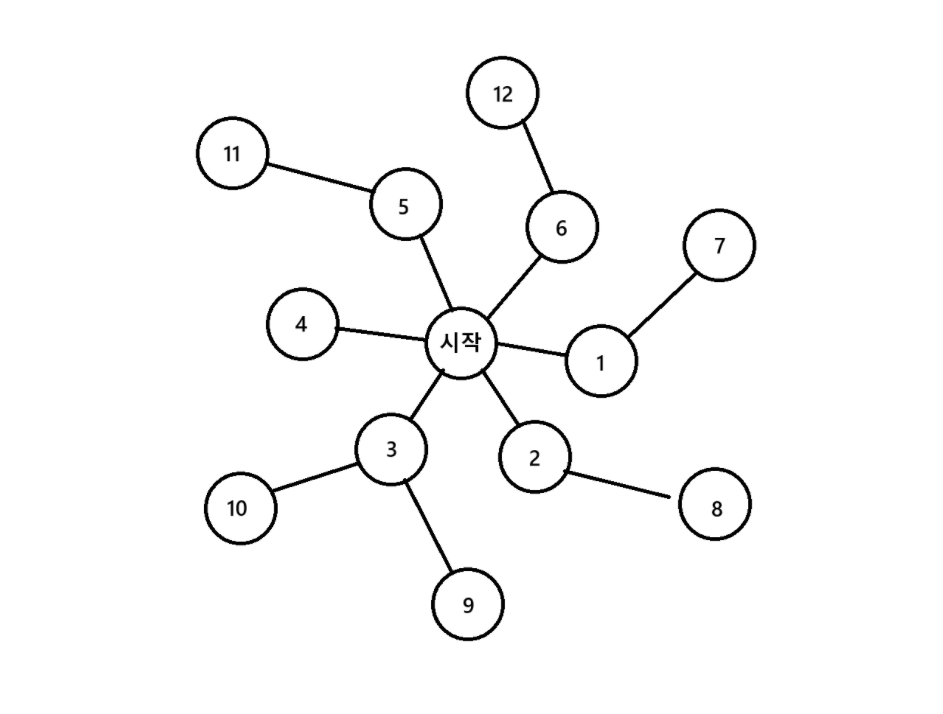
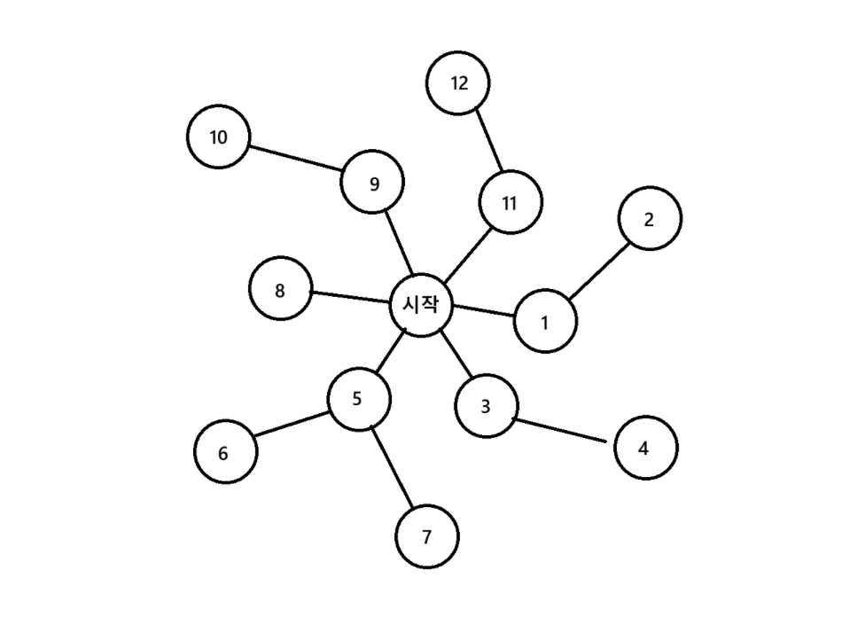

# BFS

## BFS란?

BFS는 Breadth Fisrt Search의 약어로 단어 그대로 넓게 펴져서 탐색하는 것을 말합니다.
좀 더 자세하게 말하면 어떤 탐색해야 할 것을 그래프 자료구조 형태로 나타내었을 때 주변 노드부터
탐색하는 것을 BFS라 합니다.



이 알고리즘은 한 노드에 연결되는 모든 노드를 순차적으로 탐색하기 때문에 가중치가 없는 그래프에서는
시작 노드로부터 끝 노드까지 최단 거리를 알아낼 수 있습니다.
추가적으로 DFS와는 다르게 순차적으로 탐색하기에 그래프의 길이가 무한해도 답을 찾을 수 있습니다.

## 구현

BFS는 배열을 사용할 수도 있고 큐를 사용할 수도 있지만 일반적으로 큐를 이용하여 구현하는 편입니다.

아래는 일반적으로 큐를 사용하는 BFS 코드 템플릿입니다.

```cpp
#include <queue>

using namespace std;

void bfs(int startNode)
{
    queue<int> q;

    q.push(startNode);

    while(!q.empty())
    {
        const int node = q.front();
        q.pop();

        // 조건에 맞으면 리턴하는 코드

        /*
        * 조건에 따라
        * 큐에 노드를 추가하는 코드
        */
    }
}

```

## 시간 복잡도와 공간 복잡도

BFS의 시간 복잡도는 최악의 경우, 모든 노드를 한번씩 탐색해야하기 때문에 $O(N)$ 입니다.

공간복잡도의 경우 최악의 경우, 모든 노드를 큐에 저장해야 할 수 있기 때문에 $O(N)$ 의
공간 복잡도를 가집니다.

# DFS

## DFS란?

DFS는 Depth First Search의 약자로서 단어 그대로 깊은 곳 먼저 탐색하는 알고리즘입니다.
DFS는 노드의 갈림길이 나왔을 때 한 노드를 쭉 따라가 그 경로에 가장 깊은 곳까지 들어갔다가 나오면서
탐색하는 알고리즘입니다.



DFS는 현 경로상의 노드들만 기억하면 되므로 비교적 공간 복잡도가 작습니다.

## 구현

DFS는 스택과 재귀 함수로 구현할 수 있지만 일반적으로는 재귀 함수를 이용해 구현합니다.
구조상 스택 오버플로우가 쉽게 발생할 수 있기에 주의해야 합니다.

```cpp
int visited[MAX];
vector<int> graph[]

void dfs(int current) {
    visited[current] = true;

    for(int next: graph[current]) {
        if(!visited[next]) {
            dfs(next);
        }
    }
}
```

## 시간 복잡도와 공간 복잡도

DFS는 최악의 경우, 모든 노드를 한번씩 탐색해야 하기에 시간 복잡도는 $O(N)$ 입니다.

공간 복잡도는 최악의 경우, 가장 깊은 곳까지의 길이기에 그래프의 길이를 d라 하면 $O(d)$ 입니다.
