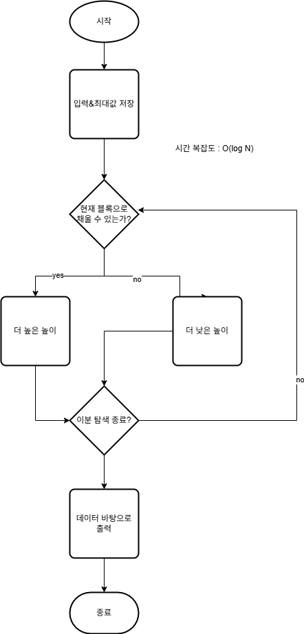

# 백준 18111문제 c++ 풀이

## 문제 

>팀 레드시프트는 대회 준비를 하다가 지루해져서 샌드박스 게임인 ‘마인크래프트’를 켰다. 마인크래프트는 1 × 1 × 1(세로, 가로, 높이) 크기의 블록들로 이루어진 3차원 세계에서 자유롭게 땅을 파거나 집을 지을 수 있는 게임이다.
>
> 목재를 충분히 모은 lvalue는 집을 짓기로 하였다. 하지만 고르지 않은 땅에는 집을 지을 수 없기 때문에 땅의 높이를 모두 동일하게 만드는 ‘땅 고르기’ 작업을 해야 한다.
>
>?lvalue는 세로 _N_, 가로 _M_ 크기의 집터를 골랐다. 집터 맨 왼쪽 위의 좌표는 (0, 0)이다. 우리의 목적은 이 집터 내의 땅의 높이를 일정하게 바꾸는 것이다. 우리는 다음과 같은 두 종류의 작업을 할 수 있다.
>
>1. 좌표 (_i_, _j_)의 가장 위에 있는 블록을 제거하여 인벤토리에 넣는다.
>2. 인벤토리에서 블록 하나를 꺼내어 좌표 (_i_, _j_)의 가장 위에 있는 블록 위에 놓는다.
>
 >1번 작업은 2초가 걸리며, 2번 작업은 1초가 걸린다. 밤에는 무서운 몬스터들이 나오기 때문에 최대한 빨리 땅 고르기 작업을 마쳐야 한다. ‘땅 고르기’ 작업에 걸리는 최소 시간과 그 경우 땅의 높이를 출력하시오.
>
> 단, 집터 아래에 동굴 등 빈 공간은 존재하지 않으며, 집터 바깥에서 블록을 가져올 수 없다. 또한, 작업을 시작할 때 인벤토리에는 _B_개의 블록이 들어 있다. 땅의 높이는 256블록을 초과할 수 없으며, 음수가 될 수 없다.

## 입력

> 첫째 줄에 _N, M_, _B_가 주어진다. (1 ≤ _M_, _N_ ≤ 500, 0 ≤ _B_ ≤ 6.4 × 107)
>
> 둘째 줄부터 _N_개의 줄에 각각 _M_개의 정수로 땅의 높이가 주어진다. (_i_ + 2)번째 줄의 (_j_ + 1)번째 수는 좌표 (_i_, _j_)에서의 땅의 높이를 나타낸다. 땅의 높이는 256보다 작거나 같은 자연수 또는 0이다.

## 출력

> 첫째 줄에 땅을 고르는 데 걸리는 시간과 땅의 높이를 출력하시오. 답이 여러 개 있다면 그중에서 땅의 높이가 가장 높은 것을 출력하시오.

## 예제 입력 1

> `입력:`   
> 3 4 99  
 0 0 0 0    
 0 0 0 0    
 0 0 0 1  

>`출력:`  
> 2 0

## 예제 입력 2

> `입력 : `  
> 3 4 1  
64 64 64 64  
64 64 64 64  
64 64 64 63  

> `출력 : `  
> 1 64

## 예제 출력 3

> `입력 : `  
> 3 4 0  
64 64 64 64  
64 64 64 64  
64 64 64 63  

> `출력 : `  
> 22 63
## 아이디어



## 1차 시도

```cpp
#include <iostream>

int N, B, M;
int* data;
int** arr;

int BinarySearch(const int lowHeight, const int highHeight, const int blocks)
{
    const int midHeight = (lowHeight + highHeight) / 2;

    int needBlocks = 0;
    int higherHeightTime = highHeight > 256 ? 500 * 500 * 256 : 0;
    int lowerHeightTime = lowHeight < 0 ? 500 * 500 * 256 : 0;

    for (int i = 0; i < N; ++i)
        for (int j = 0; j < M; ++j)
        {
            const int higherDeltaBlock = highHeight - arr[i][j];
            const int deltaBlock = midHeight - arr[i][j];
            const int lowerDeltaBlock = lowHeight - arr[i][j];

            if (higherDeltaBlock > 0)
                higherHeightTime += higherDeltaBlock;
            else if (higherHeightTime < 0)
                higherHeightTime -= 2 * higherDeltaBlock;

            if (lowerDeltaBlock > 0)
                lowerHeightTime += lowerDeltaBlock;
            else if (lowerDeltaBlock < 0)
                lowerHeightTime -= 2 * lowerDeltaBlock;

            needBlocks += deltaBlock;
        }

    if (highHeight - lowHeight <= 1) return higherHeightTime > lowerHeightTime ? lowerHeightTime : higherHeightTime;

    if (needBlocks > blocks)
        return BinarySearch(lowHeight, midHeight - 1, blocks);
    else if (needBlocks == blocks)
        return BinarySearch(lowHeight, midHeight, blocks);
    else
    {
        if (higherHeightTime > lowerHeightTime)
            return BinarySearch(lowHeight, midHeight, blocks);
        else
            return BinarySearch(midHeight, highHeight, blocks);
    }
}

int main()
{
    std::cin >> N >> M >> B;

    data = new int[N * M];
    arr = new int*[N];

    for (int i = 0; i < N; ++i)
    {
        arr[i] = data + (i * M);
        for (int j = 0; j < M; ++j)
        {
            std::cin >> data[i * M + j];
            arr[i][j] = data[i * M + j];
        }
    }

    int resultHeight = BinarySearch(0, 256, B);

    int time = 0;

    for (int i = 0; i < N; ++i)
        for (int j = 0; j < M; ++j)
        {
            int deltaHeight = resultHeight - arr[i][j];
            if (deltaHeight > 0)
                time += deltaHeight;
            else if (deltaHeight < 0)
                time -= 2 * deltaHeight;
        }

    std::cout << time << " " << resultHeight;
}
```

:::caution[결과]  
틀렸습니다  
::: 

## 1차 시도 실패 원인 분석

이분탐색으로 하려면 시간과 필요한 블럭, 2가지를 고려해야 해서 알고리즘을 더 복잡하게 만들어야 할 것 같아 브루스포트에 걸리는 시간을 계산해보니 $O(500*500*256)$의 시간 복잡도가 들것 같아 브루스 포트로 시도해보기로했다. 

## 2차 시도

```cpp
#include <iostream>  
#include <numeric>  
  
int N, B, M;  
int* data;  
int** arr;  
  
int main()  
{  
    std::cin >> N >> M >> B;  
  
    data = new int[N * M];  
    arr = new int*[N];  
  
    for (int i = 0; i < N; ++i)  
    {  
        arr[i] = data + (i * M);  
        for (int j = 0; j < M; ++j)  
        {  
            std::cin >> data[i * M + j];  
            arr[i][j] = data[i * M + j];  
        }  
    }  
  
    int finalTime = std::numeric_limits<int>::max();  
    int finalHeight = 0;  
  
    for (int height = 0; height <= 256; ++height)  
    {  
        int time = 0;  
        int needBlocks = 0;  
        for (int i = 0; i < N; ++i)  
            for (int j = 0; j < M; ++j)  
            {  
                const int deltaBlock = arr[i][j] - height;  
                if (deltaBlock > 0)  
                    time += 2 * deltaBlock;  
                else if (deltaBlock < 0)  
                    time -= deltaBlock;  
                needBlocks -= deltaBlock;  
            }  
        if (time <= finalTime && needBlocks <= B)  
        {  
            finalTime = time;  
            finalHeight = height;  
        }  
    }  
  
    std::cout << finalTime << " " << finalHeight;  
  
    delete[] arr;  
    delete[] data;  
}
```

:::note[결과]
맞았습니다!!  
:::

깃헙 링크 : [link](https://github.com/Ushio-Hayase/Baekjoon/tree/main/%EB%B0%B1%EC%A4%80/Silver/18111.%E2%80%85%EB%A7%88%EC%9D%B8%ED%81%AC%EB%9E%98%ED%94%84%ED%8A%B8)