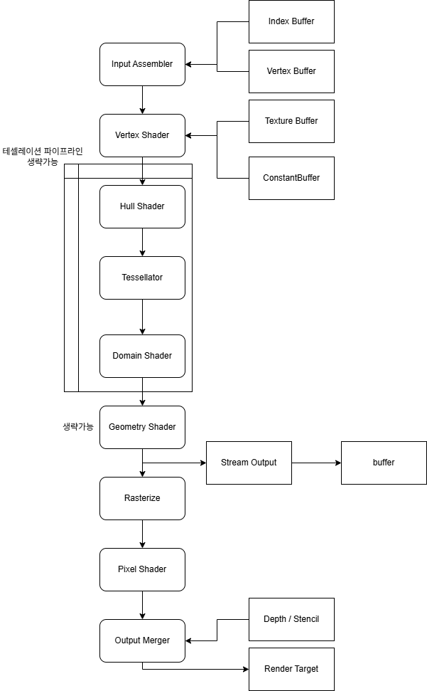

## 기본적인 단계

Direct3D에서의 렌더링을 시키는 과정은 단순화하면 3가지의 단계로 추상화할 수 있습니다.
> 준비 -> 설정 -> 렌더링

준비 단계에서는 렌더링에 필요한 각종 버퍼와 객체들을 초기화합니다.
설정 단계에서는 초기화한 버퍼와 객체들을 렌더링 파이프라인의 각 단계에 묶어줍니다.
마지막 렌더링 단계에서는 말 그대로 렌더링합니다.

## 렌더링 파이프라인

렌더링 파이프라인은 DirectX 11 기준으로 총 9단계가 존재합니다.

이 중 Hull Shader, Tessellator, Domain Shader는 Tessellator Pipeline이라고 따로 묶입니다.

테셀레이션 파이프라인의 요소와 Geometry Shader는 생략이 가능합니다.

각 셰이더의 역할은 다음과 같습니다.

| 셰이더 이름                         | 역할                         | 입력 단위               | 출력 단위                        |
| ----------------------------------- | ---------------------------- | ----------------------- | -------------------------------- |
| 정점 셰이더 (Vertex Shader)         | 공간변환                     | 정점                    | 변환된 정점                      |
| 헐 셰이더 (Hull Shader)             | LOD 결정                     | 패치와 제어점           | 테셀레이션 계수	및 제어점 데이터 |
| 도메인 셰이더 (Domain Shader)       | 곡면 계산 및 위치 확정       | 생성된 정점 1개         | 완성된 정점 1개                  |
| 지오메트리 셰이더 (Geometry Shader) | 도형을 복제, 변형, 또는 삭제 | 도형 1개 (점/선/삼각형) | 0개 이상의 도형                  |
| 픽셀 셰이더 (Pixel Shader)          | 최종 색상 결정               | 픽셀 1개                | 픽셀 색상(RGBA)                  |

