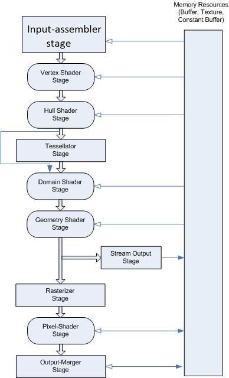

## 개요

DirectX 11의 그래픽 파이프라인은 DirectX 10의 그래픽 파이프라인과 같은 단계를 지원하고
거기에 추가적인 단계가 추가되어져 있습니다.

파이프라인은 아래 그림과 같이 이루어져 있습니다.

이 파이프라인을 사용하여 DirectX에서 3D 그래픽을 모니터로 출력할 수 있습니다.

각각의 파이프라인 단계들은 미리 정의하여 런타임에 실행됩니다.

이 단계들을 중간에 수정할 수도 있겠지만 그럴 시 CPU와 GPU간의 통신이 필요해
속도가 느려지게됩니다.

각 단계들은 HLSL(High-Level Shader Language)라는 언어를 사용해 구성됩니다.
