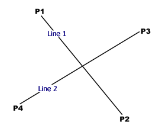

## 개요

두 선분이 있을 때 교점의 좌표를 구하는 알고리즘 중 알고있는 것은 직선의 방정식을 기울기와 y절편을 이용해 구하는 방법과 매개변수 방정식을 이용해 나타내어 구하는 방법이 있습니다.

기울기와 y절편을 이용하는 방법은 초중고동안 비슷한 문제를 많이 풀며 익숙하지만 기울기가 무한, 즉 직선이 y축에 평행할 때 따로 조건을 분기해서 처리를 해야하는 번거로움이 있습니다.

또한 이 방법들은 직선의 방정식을 이용하는 방법들이기에 교점이 선분안에 존재하는지 확인해야합니다.

그래서 두 양 끝점을 종점으로 두는 벡터를 두고 그 벡터의 합을 이용해 직선을 표현하는 방식으로 교점을 구할 수 있습니다.

## 방법

먼저 두 선분의 양 끝점 좌표를 각각 P1:x1,y1/P2:x2,y2/P3:x3,y3/P4:x4,y4라고 하겠습니다.

이 때 두 선분을 포함하는 직선의 방정식을 매개변수 t와 s를 사용하여 나타내면 다음과 같습니다.

$$P(t) = (1-t)P_1+tP_2$$
$$P(s) = (1-s)P_3+sP_4$$

이 때 선분을 나타내려면 t와 s는 0에서 1까지의 값을 가져야합니다.

두 선의 교점은 두 선이 모두 그 점을 지나므로 위 2개의 식을 아래와 같이 쓸 수 있습니다.

$$(1-t)P_1+tP_2 = (1-s)P_3+sP_4$$

이 식을 x좌표와 y좌표로 분해해보면 다음과 같습니다.

$$x_1+t(x_2-x_1)=x_3+s(x_4-x_3)\\y_1+t(y_2-y_1)=y_3+s(y_4-y_3)$$

위 식을 t와 s에 대한 식으로 정리합니다.

$$(x_2-x_1)t-(x_4-x_3)s=x_3-x_1\\(y_2-y_1)t-(y_4-y_3)s=y_3-y_1$$

이 연립방정식을 행렬로 표현하면 다음과 같습니다.

$$\begin{pmatrix}x_2-x_1&-(x_4-x_3)\\y_2-y_1&-(y_4-y_3)\end{pmatrix}\begin{pmatrix}t\\s\end{pmatrix}=\begin{pmatrix}x_3-x_1\\y_3-y_1\end{pmatrix}$$

이제 이 식을 크레이머 공식을 이용해 t와 s에 대해 정리하면 다음값이 나옵니다.

$$ t = \frac{(x_1-x_3)(y_3-y_4)-(y_1-y_3)(x_3-x_4)}{(x_1-x_2)(y_3-y_4)-(y_1-y_2)(x_3-x_4)}$$

$$s = \frac{(x_2-x_1)(y_1-y_3)-(y_2-y_1)(x_1-x_3)}{(y_4-y_3)(x_2-x_1)-(x_4-x_3)(y_2-y_1)}$$

---

크라메르 공식은 행렬식을 이용하여 연립방정식의 해를 구하는 공식으로 일반화된 공식은 다음과 같습니다.

$$\bold A\bold x=\bold B$$

위와 같은 조건일 때 $\bold x$의 각 원소의 해는 다음과 같습니다.

$$x_i = \frac{\det A_i}{\det A}$$

---

이제 t와 s를 모두 구했으므로 처음 직선의 방정식에 대입해보면 아래와 같이 답을 구할 수 있습니다.

$$x=x_1+t(x_2-x_1)$$
$$y=y_1+t(y_2-y_1)$$

이렇게 구했을때 구하는 도중 분모가 0이 되면 두 선은 평행하단 의미이고 분자,분모가 동시에 0이면 두 직선은 동일선상에 있습니다.

s와 t가 **0에서 1사이가 아닌 경우 두 선분은 교차하지 않습니다.**
