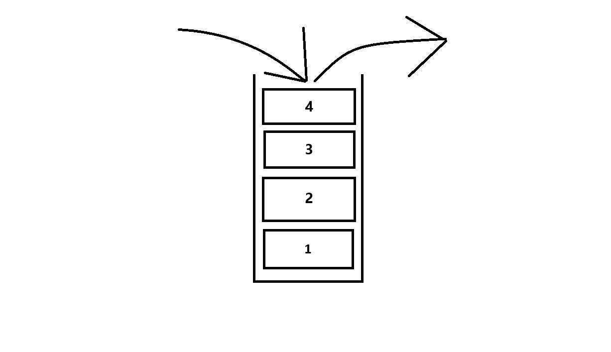
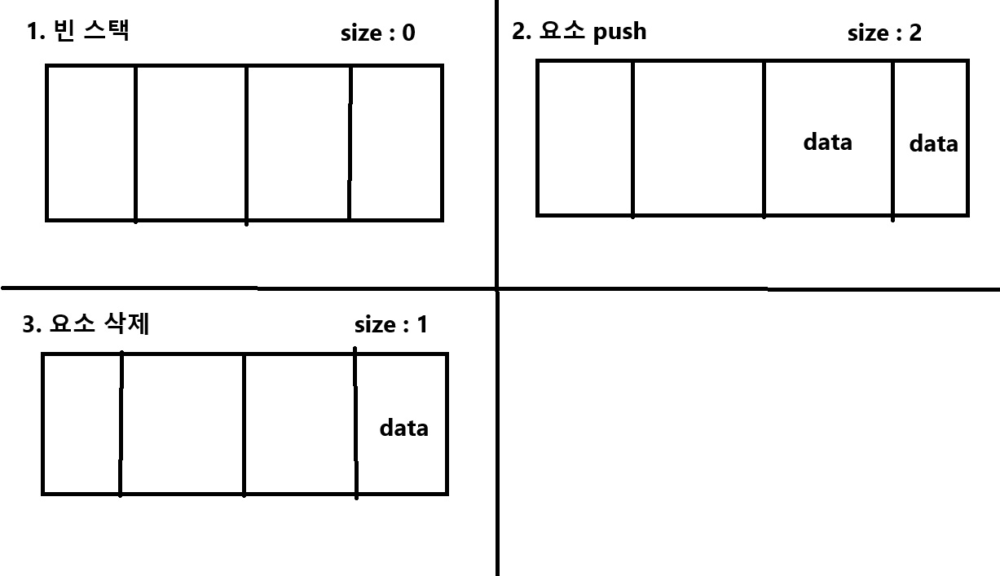
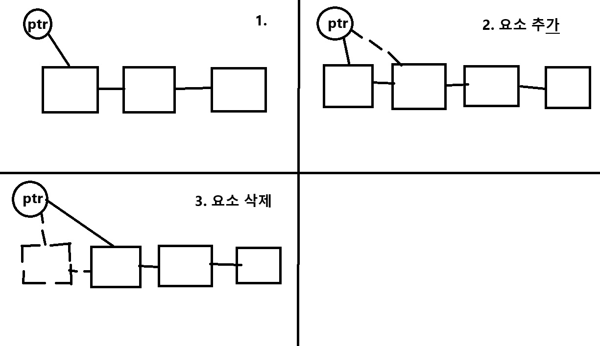

# 스택

스택 (Stack)

## 추상적 자료형으로서의 스택

스택은 데이터를 차곡차곡 쌓아 올린 형태의 자료구조로 다음과 같은 특징을 가집니다.  

1. LIFO(Last In, First Out; 후입선출)의 구조로 가장 먼저 넣은 데이터가 가장 나중에 나옵니다.
2. 스택의 top라 불리는 지점에서만 데이터의 삽입과 삭제가 이루어집니다.  



스택은 간단하고 효율적인 구조라 구현이 쉽고 데이터의 추가, 삭제가 빨라 많은 곳에서 사용됩니다.  
대표적으로 뒤로가기 기능(undo), 재귀 알고리즘 구현 등등에서 사용됩니다.  

### 스택이 정의하는 연산

스택은 여러가지 연산을 지원하지만 주로 말하는 연산은 다음과 같습니다.

1. Push : 스택에 데이터를 넣는 연산
2. Pop : 스택에서 데이터를 빼내는 연산  

이 연산들은 모두 스택의 top라는 곳에서 이루어지게 됩니다.


### 스택을 구현하는 방법

스택을 구현하는 방법은 당연히 여러가지가 있지만 대표적으로 이 3가지를 주로 사용합니다.  

---

1. 배열을 이용한 구현:  
고정 크기의 배열을 사용합니다.
top 변수로 스택의 최상단 요소를 추적합니다.
push 연산은 top을 증가시키고 해당 위치에 데이터를 저장합니다.
pop 연산은 top의 데이터를 반환하고 top을 감소시킵니다.



---

2. 동적 배열을 이용한 구현:  
배열이 가득 차면 크기를 동적으로 늘립니다.
push 연산 시 배열이 가득 찼다면, 더 큰 배열을 할당하고 데이터를 복사합니다.

---

3. 연결 리스트를 이용한 구현:  
각 노드가 데이터와 다음 노드를 가리키는 포인터를 갖습니다.
push 연산은 새 노드를 생성하여 리스트의 맨 앞에 추가합니다.
pop 연산은 첫 번째 노드를 제거하고 그 데이터를 반환합니다.



---

## C++에서의 스택 

C++에서 스택은 다음과 같이 선언합니다.

```cpp
#include <stack>

std::stack<int> stack;
```

### 스택의 주요 멤버 변수

```cpp
template <class _Ty, class _Container = deque<_Ty>>
class stack
{
    // 기타 코드...
protected:
    _Container c{};
}
```

이 코드는 MSVC 2022에서 stack 헤더에 있는 코드를 가져온 것입니다.  
보이는 것과 같이 스택은 덱을 이용하여 구현하고 있는 것을 볼 수 있습니다.  

### 스택의 주요 메서드 

스택의 메소드 역시 덱의 메소드를 호출하는 형태로 구현되어 있는 걸 아래 코드를 통해 보실 수 있습니다.  

```cpp
_NODISCARD_EMPTY_MEMBER_NO_CLEAR bool empty() const noexcept(noexcept(c.empty())) /* strengthened */ {
    return c.empty();
}

_NODISCARD size_type size() const noexcept(noexcept(c.size())) /* strengthened */ {
    return c.size();
}

_NODISCARD reference top() noexcept(noexcept(c.back())) /* strengthened */ {
    return c.back();
}

_NODISCARD const_reference top() const noexcept(noexcept(c.back())) /* strengthened */ {
    return c.back();
}

void push(const value_type& _Val) {
    c.push_back(_Val);
}

void push(value_type&& _Val) {
    c.push_back(_STD move(_Val));
}

void pop() noexcept(noexcept(c.pop_back())) /* strengthened */ {
    c.pop_back();
}
```

각 메서드는 위쪽부터
- 스택이 비었는지 확인
- 스택의 크기 확인
- 스택의 가장 위쪽 요소 반환
- 스택에 요소 넣기
- 스택에서 요소 제거
기능들을 수행합니다. 