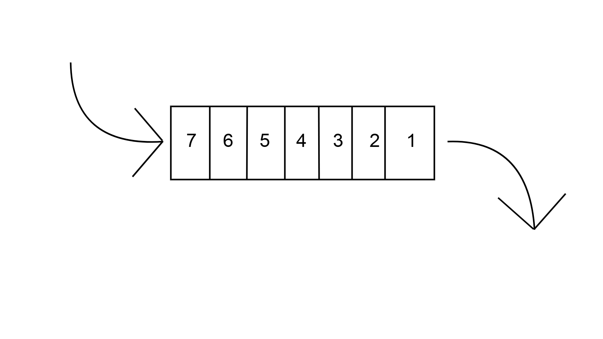
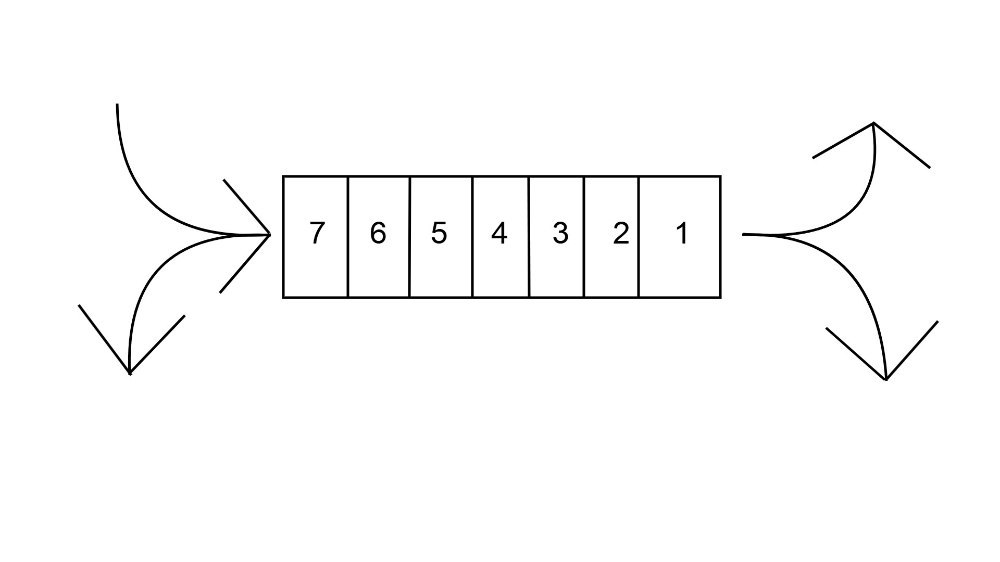

# 큐

큐(Queue)

## 추상적 자료형으로서의 큐 

### 큐 정의

큐는 FIFO(First In, First Out; 선입선출)의 자료구조로 
먼저 들어간 자료가 먼저 출력되는 형태입니다. 
그림으로는 아래와 같이 나타낼 수 있습니다. 
 


데이터가 들어가는 쪽인 큐의 뒤쪽은 rear라 부르고
데이터가 나오는 쪽인 큐의 앞쪽은 front라 부릅니다.

### 큐를 정의하는 동작
1. 인큐(Enqueue) : 큐에 새로운 데이터를 추가하는 연산입니다. 데이터는 큐의 맨 뒤(rear)에 삽입됩니다.
2. 디큐(Dequeue) : 큐에서 데이터를 꺼내는 연산입니다. 큐의 맨 앞(front)에 있는 데이터를 제거하고 반환합니다.
3. 피크(Peek) : 큐의 맨 앞(front)에 있는 데이터를 조회하는 연산입니다.
4. IsEmpty : 큐가 비어있는지 확인하는 연산입니다. 

## C++에서의 큐

```cpp
#include <queue>

std::queue<int> q; // int 형의 큐 선언
```

### 큐의 멤버 변수

```cpp
template <class _Ty, class _Container = deque<_Ty>>
class queue
{
    // 기타코드...
protected:
    // 덱을 주어진 템플릿 인자의 자료형으로 생성
    _Container c{};
}
```
이 코드처럼 C++ STL에서의 큐는 STL의 덱을 이용하도록 설계되어 있습니다.

### 큐의 메소드
```cpp
// 큐가 비었는지 확인
_NODISCARD_EMPTY_MEMBER_NO_CLEAR bool empty() const noexcept(noexcept(c.empty())) /* strengthened */ {
    return c.empty();
}

// 큐의 크기 확인
_NODISCARD size_type size() const noexcept(noexcept(c.size())) /* strengthened */ {
    return c.size();
}

// 큐의 front(앞)의 참조자 반환
_NODISCARD reference front() noexcept(noexcept(c.front())) /* strengthened */ {
    return c.front();
}


// 큐의 front(앞)의 상수 참조자 반환 
_NODISCARD const_reference front() const noexcept(noexcept(c.front())) /* strengthened */ {
    return c.front();
}

// 큐의 rear(뒤)의 참조자 반환 
_NODISCARD reference back() noexcept(noexcept(c.back())) /* strengthened */ {
    return c.back();
}

// 큐의 rear(뒤)의 상수 참조자 반환환
_NODISCARD const_reference back() const noexcept(noexcept(c.back())) /* strengthened */ {
    return c.back();
}

// 큐에 요소 추가 (l-value;좌측값)
void push(const value_type& _Val) {
    c.push_back(_Val);
}

// 큐에 요소 추가 (r-value;우측값)
void push(value_type&& _Val) {
    c.push_back(_STD move(_Val));
}
```

마찬가지로 큐의 메소드 또한 덱의 메소드를 호출하는 형태로 구현되어있습니다.

# 덱

덱(Deque; Double-Ended Queue) 

## 추상적 자료형으로서의 덱

### 덱의 정의

1. 덱은 양쪽 끝에서 삽입과 삭제가 가능한 자료구조입니다.
2. 덱은 큐와 스택의 특성을 모두 가지고 있어, 데이터의 FIFO(First In, First Out; 선입선출)와 LIFO(Last In, First Out; 후입선출)을 유연하게 조합할 수 있습니다.
3. 덱은 리스트와 유사하지만, 항목의 추가와 삭제가 주로 양 끝에서 이루어집니다.



### 덱의 주요 동작 

1. 덱 앞 쪽에 요소 추가
2. 덱 뒤 쪽에 요소 추가
3. 덱 앞 쪽의 요소 반환
4. 덱 뒤 쪽의 요소 반환
5. 덱 앞 쪽 요소 삭제
6. 덱 뒤 쪽 요소 삭제
7. 덱이 가득 찼는지 확인

## C++ STL에서의 덱

```cpp
#include <deque>

std::deque<int> dq;
```

### 덱의 멤버 변수

```cpp
template <class _Ty, class _Alloc = allocator<_Ty>>
class deque
{
    using _Alty = _Rebind_alloc_t<_Alloc, _Ty>;
    using _Scary_val = _Deque_val<conditional_t<_Is_simple_alloc_v<_Alty>, _Deque_simple_types<_Ty>,
    _Deque_iter_types<_Ty, typename _Alty_traits::size_type, typename _Alty_traits::difference_type,
        typename _Alty_traits::pointer, typename _Alty_traits::const_pointer, _Mapptr>>>;

    // 메모리를 할당하고 관리하는 객체 
    _Compressed_pair<_Alty, _Scary_val> _Mypair;
}

```

STL에서 덱은 위 코드처럼 템플릿을 이용하여 작성되어 있습니다. `_Compressed_pair`는 위 코드에서 `_Alty`가 상태를 가지지 않을 때 메모리 오버헤드를 줄이기 위해 사용합니다. `_Alty`는 Allocator라고 부르는 덱의 메모리 할당과 해제를 관리하는 객체입니다. STL의 덱에서는 메모리 상에서 연속된 단일 배열을 사용하지않고 한 블록,청크 단위로 메모리를 할당합니다. Allocator는 `std::allocator_traits::allocate()`를 사용하여 새로운 청크를 할당하고 `std::allocator_traits::construct()`를 호출하여 개별 객체의 생성자를 호출합니다. 특정 청크, 블록이 필요없어지면 `std::allocator_traits::destroy()`를 호출하여 객체의 소멸자를 실행하고 객체가 모두 소멸되면 `std::allocator_traits::deallocate()`를 호출하여 메모리를 해제합니다.

덱은 각 청크를 포인터 배열을 이용해서 관리합니다.
```cpp
template <class _Val_types>
class _Deque_val : public _Container_base12
{
    public:
    using value_type      = typename _Val_types::value_type;
    using size_type       = typename _Val_types::size_type;
    using difference_type = typename _Val_types::difference_type;
    using pointer         = typename _Val_types::pointer;
    using const_pointer   = typename _Val_types::const_pointer;
    using reference       = value_type&;
    using const_reference = const value_type&;
    using _Mapptr         = typename _Val_types::_Mapptr;

    // 기타 코드...

    _Mapptr _Map; // pointer to array of pointers to blocks
    size_type _Mapsize; // size of map array, zero or 2^N
    size_type _Myoff; // offset of initial element
    size_type _Mysize; // current length of sequence
};
```
위 코드에서 `_Map`이 그 역할을 수행하고 포인터 배열의 사이즈는 2의 n승을 가집니다.


### 덱의 메소드 

덱의 주요한 메소드는 
1. push_back()
2. push_front()
3. pop_back()
4. pop_front()
등이 있습니다. 

push_back과 push_front는 해당 블록이 가득차면 새 블록을 추가하는 방식이고 pop_back과 pop_front도 지우는 데이터가 블록의 마지막 데이터면 블록도 같이 할당 해제하는 방식으로 구현됩니다. 